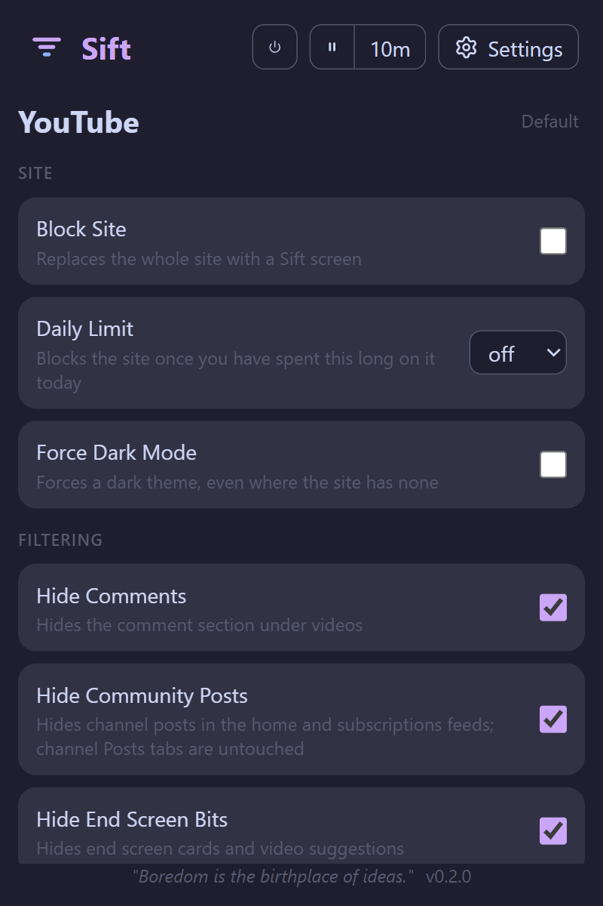
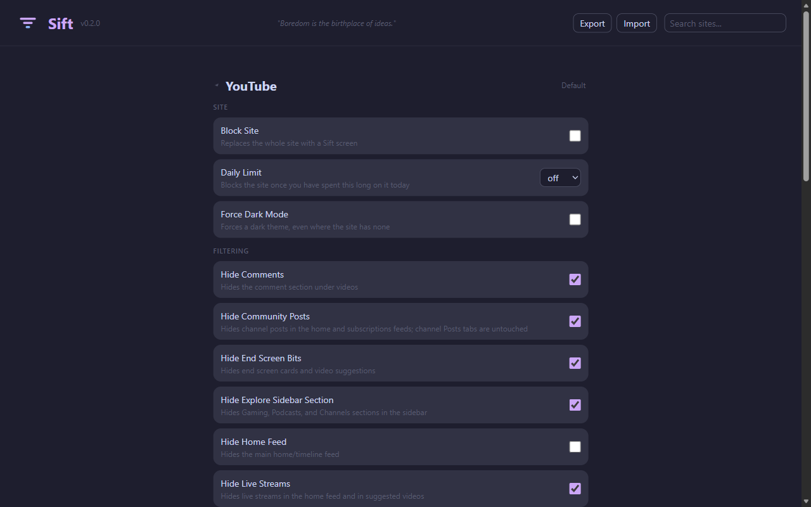
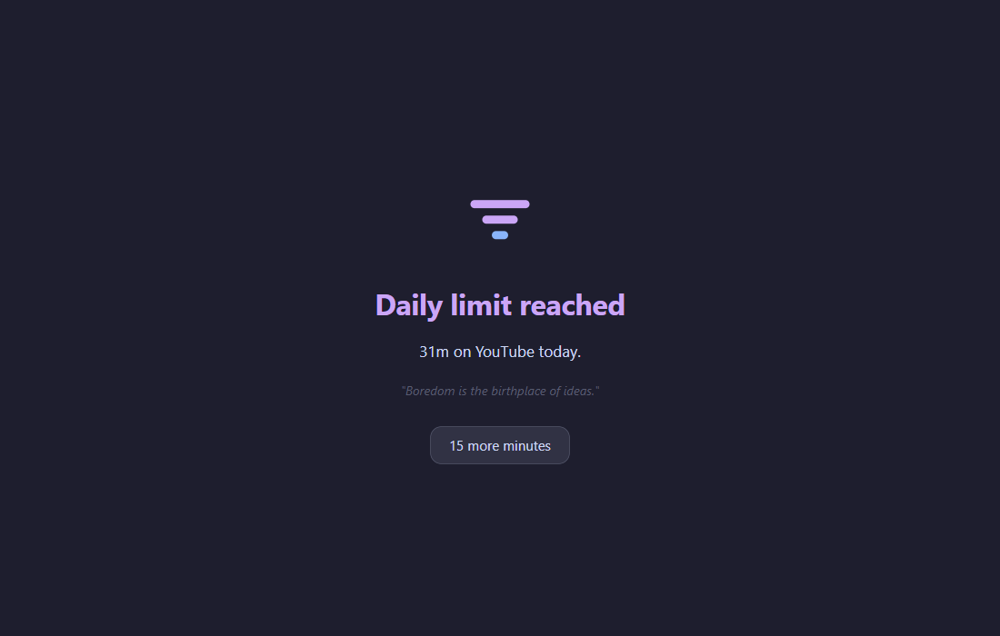
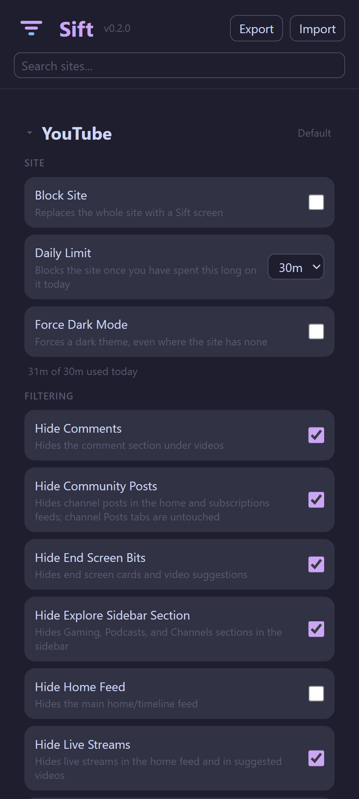

# Sift

A Firefox browser extension (forked from [Feedless](https://github.com/ZMensRain/Feedless)) that lets you hide algorithmic feeds and distracting content on social media, while keeping the features you actually use.

*"Boredom is the birthplace of ideas."*

## Screenshots

| Popup | Settings |
| --- | --- |
|  |  |

| Daily limit reached | Settings on a phone |
| --- | --- |
|  |  |

## Features

- Hide "For You" / algorithmic feeds independently from "Following" feeds
- Hide explore/discovery feeds while keeping search functional
- Hide shortform content (Reels, Shorts, TikToks)
- Hide sidebar clutter (Grok, trending, who to follow, recommendations, etc.)
- Site-aware popup: click the extension icon on any supported site to see only that site's settings
- Turn Sift off per site, without losing that site's settings
- Pause / Pause for 10 minutes — temporarily stop filtering on a site
- Block a site outright, or give it a daily time limit
- Force dark mode on sites that have no dark theme
- Export/import settings as JSON
- Firefox Android support (tested on m.twitch.tv and mobile web)

## Supported Platforms

- **YouTube & YouTube Music** — on top of the feed options, YouTube can also hide:
  - thumbnails (rows collapse to titles and channel names), comments, and end-screen cards
  - community posts, live streams, Mixes and radio playlists, Playables and "Explore more topics"
    shelves — all in the feed only, so anything you open on purpose still works
- Twitter/X
- Instagram
- TikTok
- Reddit (new and old.reddit.com)
- LinkedIn
- Facebook
- Bluesky
- Pinterest
- Substack
- **Twitch** (www.twitch.tv + m.twitch.tv)
  - Redirects home to Following on desktop and mobile
  - Hides Live Channels, Recommended Categories, Viewers Also Watch sidebar sections
  - Hides Open App prompt and Go Ad-Free upsell

## Site controls

Every supported site has the same four controls, independent of its filtering options:

- **Turn off** (popup, power button) — Sift stops touching the site; settings are kept
- **Pause** (popup, ⏸ / 10m) — same, but temporary
- **Block Site** — replaces the site with a Sift screen, with a "15 more minutes" escape
- **Daily Limit** — off / 5m / 15m / 30m / 1h / 2h; the same screen appears once you are over

Time is only counted for sites that have a limit set, only while the tab is the active tab in
the focused window, and only per device — usage lives in local storage, keyed by the local date.

## Config keys

### Site

**`{platform}-disabled`** — `"true"` / `"false"` — turns Sift off on that site entirely

**`{platform}-blocked`** — `"true"` / `"false"` — blocks the site behind the Sift screen

**`{platform}-daily-limit`** — `off` / `5m` / `15m` / `30m` / `1h` / `2h`

**`{platform}-force-dark`** — `"true"` / `"false"` — uses the site's own dark theme where Sift
knows it, and falls back to an inverting filter only if the page still renders light

### Shortform content

**`{platform}-shortform`** — one of:

- **`hide`** (default) — hides shortform from the UI but allows watching when shared directly
- **`block`** — blocks shortform pages and hides shortform from the UI
- **`show`** — no change

### Feeds

**`{platform}-hide-feed`** — `"true"` / `"false"` — hides the main (Following/chronological) feed

**`{platform}-hide-for-you-feed`** — `"true"` / `"false"` — hides the algorithmic For You feed

**`{platform}-hide-{feedtype}-feed`** — `"true"` / `"false"` — hides a specific feed type (explore, trending, etc.)

**`{platform}-paused`** — `"true"` / `"false"` / Unix timestamp — pauses all filtering for that site; a timestamp value auto-resumes at that time

> Defaults are set per site rather than by a blanket rule: YouTube hides thumbnails, comments
> and community posts out of the box but leaves the home and subscription feeds alone, while
> Instagram and Twitter/X leave the Following feed alone and hide the algorithmic one. The site
> controls above all default to off — Sift never blocks or limits a site until you ask it to.

## Requirements

Firefox 140 or later, and Firefox for Android 142 or later. Two things set that floor: the
stylesheets rely on `:has()` (Firefox 121), and the manifest declares
`data_collection_permissions`, which AMO requires of new submissions and which landed in 140
(142 on Android).

## Building

```sh
pnpm i
pnpm build:firefox   # development build → .output/firefox-mv2/
pnpm zip:firefox     # production zip → .output/sift-{version}-firefox.zip
```

Load the extension in Firefox via `about:debugging` → Load Temporary Add-on → select any file inside `.output/firefox-mv2/`. Click **Reload** there after each build.

### Firefox Android

Firefox for Android cannot install an arbitrary `.zip` from storage — add-ons come from AMO. For
development, install the build over ADB instead, with Firefox Nightly or Beta on the device and
USB (or wireless) debugging enabled:

```sh
adb pair <ip>:<pair-port> <code>   # from Developer Options → Wireless debugging → Pair device
adb connect <ip>:<port>
npx web-ext run -t firefox-android --source-dir .output/firefox-mv2
```

`web-ext` lists the connected devices if you leave off `--android-device`. For remote debugging,
open `about:debugging` on desktop Firefox and connect to the device.
